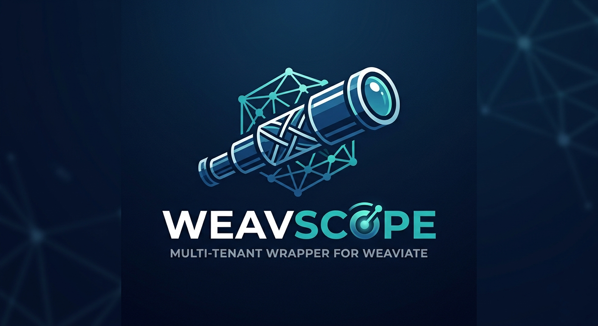

# WeavScope 🔭



<p align="center">
  <a href="https://pypi.org/project/weavscope/"></a>
  <a href="https://pypi.org/project/weavscope/"></a>
  <a href="LICENSE"></a>
</p>

> **A clean, multi-tenant wrapper for [Weaviate](https://weaviate.io/) — batteries-included, no boilerplate.**

WeavScope lets you interact with Weaviate using a simple, Pythonic API. It handles the full lifecycle: **connecting**, **creating collections**, **managing tenants**, **inserting vectors**, and **searching** — all with one consistent interface. Stop writing boilerplate; start building.

---

## Table of Contents

- [Why WeavScope?](#why-weavscope)
- [How It Works](#how-it-works)
- [Installation](#installation)
- [Core Concepts](#core-concepts)
    - [WeaviateConfig](#weaviateconfig)
    - [WeavScope](#weavscope)
    - [Tenants](#tenants)
    - [Batch Insertions](#batch-insertions)
    - [Querying](#querying)
- [Quick Start (Two-Step Pattern)](#quick-start-two-step-pattern)
- [Detailed Usage Guide](#detailed-usage-guide)
    - [Step 1: Define Your Configuration](#step-1-define-your-configuration)
    - [Step 2: Create the Collection](#step-2-create-the-collection)
    - [Step 3: Insert Data in a Tenant Scope](#step-3-insert-data-in-a-tenant-scope)
    - [Step 4: Query Within the Scope](#step-4-query-within-the-scope)
- [All Query Methods](#all-query-methods)
- [Supported Embedding Providers](#supported-embedding-providers)
- [Error Handling](#error-handling)
- [Architecture Overview](#architecture-overview)
- [AI/LLM Documentation](#aillm-documentation)
- [License](#license)

---

## Why WeavScope?

Working with Weaviate directly involves a lot of ceremony: creating clients, managing connections, building multi-tenancy configs, handling batch contexts, deserializing responses, and cleaning up after yourself. **WeavScope abstracts all of that away.**

| Without WeavScope                             | With WeavScope                            |
| --------------------------------------------- | ----------------------------------------- |
| Manual `connect_to_custom(...)` calls         | Auto-connects from `WeaviateConfig`       |
| Manually build `Configure.multi_tenancy(...)` | `ensure_collection()` handles it          |
| Manually create/delete tenants                | Auto-created & deleted by context manager |
| Manage `batch.dynamic()` context              | `scope.batch.add_objects(...)` — done     |
| Deserialize raw Weaviate objects              | Results are plain Python dicts            |

---

## How It Works

WeavScope is built around a **two-step pattern**, because collection creation (schema setup) is a one-time operation, while tenant-scoped data operations happen repeatedly:

```
┌─────────────────────────────────────────────────────────────────────┐
│ STEP 1 (once): WeavScope.ensure_collection()                        │
│   → Creates the Weaviate collection with multi-tenancy enabled.     │
│   → Idempotent: safe to call again — skips if already exists.       │
└────────────────────────────┬────────────────────────────────────────┘
                             │
┌────────────────────────────▼────────────────────────────────────────┐
│ STEP 2 (per tenant): with WeavScope(config, tenant_id="...") as ws: │
│   → Creates the tenant on __enter__                                 │
│   → Exposes ws.batch  → insert objects                              │
│   → Exposes ws.query  → search objects                              │
│   → Deletes the tenant + all its data on __exit__                   │
└─────────────────────────────────────────────────────────────────────┘
```

This separation ensures the **collection schema exists before any tenant operations happen**, and the context manager keeps each "scope" of work clean and isolated.

---

## Installation

```bash
pip install weavscope
```

Requires **Python 3.11+** and a running Weaviate instance (v1.24+ recommended for multi-tenancy support).

---

## Core Concepts

### WeaviateConfig

`WeaviateConfig` is a **plain Python dataclass** that holds all your connection and embedding settings. There is no hidden env-var magic — you control how values are supplied (hardcoded, from `os.environ`, from a secrets manager, etc.).

```python
from weavscope import WeaviateConfig

config = WeaviateConfig(
    WEAVIATE_HOST="localhost",           # Weaviate instance hostname or IP
    WEAVIATE_PORT=8080,                  # HTTP port (default: 8080)
    WEAVIATE_GRPC_PORT=50051,            # gRPC port (default: 50051)
    WEAVIATE_CLASS_NAME="MyCollection",  # Collection (class) name in Weaviate
    WEAVIATE_EMBEDDING_MODEL_PROVIDER="openai",          # Embedding provider
    WEAVIATE_EMBEDDING_MODEL_NAME="text-embedding-3-small",  # Model name
    WEAVIATE_API_KEY="",                 # Weaviate API key (empty = no auth)
    WEAVIATE_EMBEDDING_MODEL_API_KEY="", # Embedding provider API key
)
```

**Key fields:**

| Field                               | Type   | Default | Description                                                                    |
| ----------------------------------- | ------ | ------- | ------------------------------------------------------------------------------ |
| `WEAVIATE_HOST`                     | `str`  | —       | Hostname or IP of your Weaviate instance                                       |
| `WEAVIATE_PORT`                     | `int`  | `8080`  | HTTP API port                                                                  |
| `WEAVIATE_GRPC_PORT`                | `int`  | `50051` | gRPC port (required for batch imports)                                         |
| `WEAVIATE_USE_GRPC`                 | `bool` | `True`  | Use gRPC for batch inserts (faster). Set `False` for environments without gRPC |
| `WEAVIATE_CLASS_NAME`               | `str`  | —       | Name of the Weaviate collection (PascalCase recommended)                       |
| `WEAVIATE_API_KEY`                  | `str`  | `""`    | Weaviate auth key. Leave empty for open/anonymous instances                    |
| `WEAVIATE_EMBEDDING_MODEL_PROVIDER` | `str`  | —       | Embedding provider (see [Supported Providers](#supported-embedding-providers)) |
| `WEAVIATE_EMBEDDING_MODEL_NAME`     | `str`  | —       | Model name for the selected provider                                           |
| `WEAVIATE_EMBEDDING_MODEL_API_KEY`  | `str`  | `""`    | API key for the embedding provider                                             |

---

### WeavScope

`WeavScope` is the main entry point. It connects to Weaviate on instantiation and exposes two sub-interfaces:

- **`scope.batch`** — for inserting data (`WeavScopeBatch`)
- **`scope.query`** — for searching data (`WeavScopeQuery`)

It can be used as a **context manager** (recommended) or **manually** with `try/finally`.

```python
# Context manager (recommended)
with WeavScope(config, tenant_id="my-tenant") as scope:
    # tenant is created here automatically
    scope.batch.add_objects(objects=[...], id_field="title")
    results = scope.query.hybrid("my search query")
# tenant is deleted and connection is closed here automatically
```

```python
# Manual usage (when you need more control)
scope = WeavScope(config)
try:
    scope.ensure_tenant("my-tenant")
    scope.batch.add_objects(objects=[...], tenant_id="my-tenant")
    results = scope.query.hybrid("my query", tenant_id="my-tenant")
    scope.delete_tenant("my-tenant")
finally:
    scope.close()
```

---

### Tenants

WeavScope is built around Weaviate's **multi-tenancy** feature, which provides **data isolation at the tenant level**. Each tenant is a logically separate storage space within the same collection.

- Tenants are identified by a **string ID** (e.g., `"project-A"`, `"user-123"`, `"event-42"`).
- When you use `WeavScope(config, tenant_id="...")`, the tenant is **auto-created on enter** and **auto-deleted (with all its data) on exit**.
- If you want tenants to **persist** after the scope exits, manage them manually (don't pass `tenant_id` to the constructor).

**Why tenants?** They let multiple isolated workloads share a single Weaviate collection without interfering with each other. Ideal for multi-user applications, per-project vector stores, or ephemeral session data.

---

### Batch Insertions

`scope.batch.add_objects(...)` handles inserting a list of dictionaries into a tenant. It supports:

- **gRPC batching** (fast, default if `WEAVIATE_USE_GRPC=True`)
- **REST fallback** (sequential inserts if gRPC is disabled)
- **Deterministic UUIDs** — pass `id_field="title"` to generate a UUID from `(object_value, tenant_id)`, ensuring idempotent inserts (inserting the same object twice won't duplicate it)

---

### Querying

`scope.query` exposes four search methods, all returning a list of plain Python dicts:

| Method                 | Description                                            |
| ---------------------- | ------------------------------------------------------ |
| `.hybrid(query)`       | BM25 keyword + vector similarity (recommended default) |
| `.near_text(query)`    | Pure semantic (vector) search by text                  |
| `.near_vector(vector)` | Vector search using a pre-computed embedding           |
| `.bm25(query)`         | Pure keyword (BM25) search                             |
| `.fetch_all()`         | Fetch all objects from a tenant                        |
| `.fetch_by_id(uuid)`   | Fetch a single object by UUID                          |

Each result dict has the shape:

```python
{
    "uuid": "...",
    "properties": { "title": "...", "content": "...", ... },
    "score": 0.87,       # hybrid/BM25 score
    "distance": 0.12,    # vector distance
    "certainty": 0.88,   # semantic certainty
}
```

---

## Quick Start (Two-Step Pattern)

Here's the minimal, complete example to get running with a local Weaviate instance:

```python
from weavscope import WeavScope, WeaviateConfig

# Configure your connection (no credentials needed for a local open instance)
config = WeaviateConfig(
    WEAVIATE_HOST="localhost",
    WEAVIATE_PORT=8080,
    WEAVIATE_GRPC_PORT=50051,
    WEAVIATE_CLASS_NAME="Articles",
    WEAVIATE_EMBEDDING_MODEL_PROVIDER="gemini",
    WEAVIATE_EMBEDDING_MODEL_NAME="gemini-embedding-001",
    WEAVIATE_EMBEDDING_MODEL_API_KEY="your-gemini-api-key",
)

# STEP 1: Create the collection (run once — idempotent, safe to repeat)
setup = WeavScope(config)
try:
    setup.ensure_collection(
        provider="gemini",
        model="gemini-embedding-001"
    )
finally:
    setup.close()

# STEP 2: Operate within a tenant scope
# The tenant "project-A" is auto-created on entry and auto-deleted on exit.
with WeavScope(config, tenant_id="project-A") as scope:

    # Insert documents — UUIDs are derived deterministically from the title field
    scope.batch.add_objects(
        objects=[
            {"title": "Intro to AI", "content": "AI is changing the world..."},
            {"title": "Vector DBs", "content": "Vector databases are cool."},
        ],
        id_field="title"
    )

    # Search using hybrid (BM25 + vector) search
    results = scope.query.hybrid("machine learning")

    for hit in results:
        print(f"Found: {hit['properties']['title']} (score: {hit['score']})")

# Connection is closed and tenant "project-A" (with all its data) is deleted.
```

> **Why two steps?** Weaviate requires the collection (schema) to exist before tenants can be added to it. `ensure_collection()` is idempotent — safe to call every time, but typically run once during app startup or deployment.

---

## Detailed Usage Guide

### Step 1: Define Your Configuration

All settings live in one `WeaviateConfig` object. Use `os.environ` to pull secrets from environment variables:

```python
import os
from weavscope import WeaviateConfig

config = WeaviateConfig(
    WEAVIATE_HOST=os.environ.get("WEAVIATE_HOST", "localhost"),
    WEAVIATE_PORT=int(os.environ.get("WEAVIATE_PORT", 8080)),
    WEAVIATE_GRPC_PORT=int(os.environ.get("WEAVIATE_GRPC_PORT", 50051)),
    WEAVIATE_CLASS_NAME="Articles",
    WEAVIATE_API_KEY=os.environ.get("WEAVIATE_API_KEY", ""),
    WEAVIATE_EMBEDDING_MODEL_PROVIDER="gemini",
    WEAVIATE_EMBEDDING_MODEL_NAME="gemini-embedding-001",
    WEAVIATE_EMBEDDING_MODEL_API_KEY=os.environ["GEMINI_API_KEY"],
)
```

For **open/anonymous local Weaviate instances** (no auth), leave `WEAVIATE_API_KEY` empty (it defaults to `""`). The embedding model key is only required if you're using a hosted model (OpenAI, Gemini, Cohere, etc.) for server-side vectorization. If you're supplying your own pre-computed vectors, use `provider="custom"` and omit the embedding key.

---

### Step 2: Create the Collection

The collection is the Weaviate "class" (schema) that holds all your data. Multi-tenancy is enabled automatically.

```python
from weavscope import WeavScope

setup = WeavScope(config)
try:
    setup.ensure_collection(
        provider="gemini",           # Which embedding provider powers this collection
        model="gemini-embedding-001" # The specific model to use for vectorization
    )
finally:
    setup.close()
```

`ensure_collection()` is **idempotent** — if the collection already exists, it does nothing and logs a debug message. Run it at startup without worry.

You can also add **extra properties** to the schema:

```python
from weaviate.classes.config import Property, DataType

setup.ensure_collection(
    provider="openai",
    model="text-embedding-3-small",
    extra_properties=[
        Property(name="author", data_type=DataType.TEXT),
        Property(name="published_at", data_type=DataType.DATE),
        Property(name="word_count", data_type=DataType.INT),
    ]
)
```

> **Note:** `tenant_id` and `object_id` properties are always added automatically as base properties by WeavScope.

---

### Step 3: Insert Data in a Tenant Scope

```python
with WeavScope(config, tenant_id="project-A") as scope:
    scope.batch.add_objects(
        objects=[
            {"title": "Intro to AI", "content": "Artificial Intelligence is..."},
            {"title": "Deep Learning", "content": "Neural networks learn by..."},
            {"title": "RAG Systems", "content": "Retrieval Augmented Generation..."},
        ],
        id_field="title"   # Use "title" to generate deterministic UUIDs
    )
```

**How deterministic UUIDs work:** When you specify `id_field="title"`, WeavScope generates a UUID from the combination of the field value and the tenant ID using a UUID5 hash. This means:

- Inserting the same object into the same tenant produces the same UUID every time.
- Re-running your ingestion pipeline won't create duplicate records.
- Objects with the same title in _different_ tenants get different UUIDs.

**Inserting a single object:**

```python
scope.batch.add_object(
    properties={"title": "One Document", "content": "..."},
    id_field="title"
)
```

**Inserting with pre-computed vectors (custom provider):**

```python
my_vector = [0.1, 0.3, 0.5, ...]  # Your own embedding

scope.batch.add_object(
    properties={"title": "Doc", "content": "..."},
    vector=my_vector
)
```

**Deleting objects by filter:**

```python
scope.batch.delete_objects_where(
    filter_property="title",
    filter_value="Intro to AI"
)
```

---

### Step 4: Query Within the Scope

```python
with WeavScope(config, tenant_id="project-A") as scope:
    # ... (insert objects) ...

    results = scope.query.hybrid(
        query_text="neural networks",
        limit=5,         # Return up to 5 results (default: 10)
        alpha=0.75,      # 0.0 = pure BM25, 1.0 = pure vector (default: 0.75)
    )

    for hit in results:
        print(f"[{hit['score']:.3f}]  {hit['properties']['title']}")
```

---

## All Query Methods

### `scope.query.hybrid(query_text, ...)`

Combines BM25 (keyword) and vector (semantic) search. The `alpha` parameter controls the blend.

```python
results = scope.query.hybrid(
    query_text="machine learning tutorial",
    limit=10,
    alpha=0.75,                         # 75% vector, 25% BM25
    exclude_property="title",           # Optional: filter out objects where...
    exclude_value="Intro to AI",        # ...title == "Intro to AI"
    return_properties=["title"],        # Optional: only return specific properties
)
```

### `scope.query.near_text(query_text, ...)`

Pure semantic search — finds objects whose vectors are closest to the query text's embedding.

```python
results = scope.query.near_text(
    query_text="deep neural architectures",
    limit=5,
    certainty=0.8,   # Minimum similarity threshold (0.0–1.0)
    distance=0.2,    # Maximum vector distance (alternative to certainty)
)
```

### `scope.query.near_vector(vector, ...)`

Search using a pre-computed embedding vector. Useful when you already have an embedding from your own pipeline.

```python
my_embedding = [0.12, 0.45, ...]  # 768-dim or however many dims your model uses

results = scope.query.near_vector(
    vector=my_embedding,
    limit=5,
    certainty=0.7,
)
```

### `scope.query.bm25(query_text, ...)`

Pure keyword search (no vectors). Fast and effective for exact or near-exact term matching.

```python
results = scope.query.bm25(
    query_text="vector database performance",
    limit=10,
    properties=["title", "content"],  # Only search within these fields
)
```

### `scope.query.fetch_all(limit=100, ...)`

Retrieve all objects in a tenant up to a limit.

```python
all_docs = scope.query.fetch_all(limit=50, return_properties=["title"])
```

### `scope.query.fetch_by_id(uuid, ...)`

Retrieve a single object by its Weaviate UUID.

```python
doc = scope.query.fetch_by_id("3fa85f64-5717-4562-b3fc-2c963f66afa6")
if doc:
    print(doc["properties"]["title"])
```

---

## Supported Embedding Providers

Pass the provider name as a string — WeavScope maps it to the correct Weaviate vectorizer config internally.

| Provider Alias            | Weaviate Vectorizer      | Notes                                       |
| ------------------------- | ------------------------ | ------------------------------------------- |
| `"openai"`                | `text2vec_openai`        | OpenAI embedding models                     |
| `"gemini"`                | `text2vec_google_gemini` | Gemini Embedding API                        |
| `"cohere"`                | `text2vec_cohere`        | Cohere embedding models                     |
| `"google"` / `"vertexai"` | `text2vec_palm`          | Legacy Vertex AI / PaLM                     |
| `"huggingface"`           | `text2vec_huggingface`   | HuggingFace Inference API                   |
| `"voyageai"`              | `text2vec_voyageai`      | VoyageAI embedding models                   |
| `"mistral"`               | `text2vec_mistral`       | Mistral embedding models                    |
| `"jinaai"`                | `text2vec_jinaai`        | Jina AI embedding models                    |
| `"azure"`                 | `text2vec_azure_openai`  | Azure OpenAI; pass deployment name as model |
| `"custom"`                | None                     | You supply vectors manually via `vector=`   |

The embedding model API key is passed to Weaviate via the appropriate provider-specific HTTP header (e.g., `X-OpenAI-Api-Key`, `X-Goog-Api-Key`) — all handled automatically by WeavScope.

---

## Error Handling

All WeavScope exceptions inherit from `WeavscopeError`, so you can catch them broadly or specifically:

```python
from weavscope import (
    WeavscopeError,            # Base — catch all WeavScope errors
    WeavscopeConnectionError,  # Failed to connect to Weaviate
    WeavscopeCollectionError,  # Collection create/delete failed
    WeavscopeTenantError,      # Tenant create/delete/list failed
    WeavscopeBatchError,       # Batch insert/delete failed
    WeavscopeQueryError,       # Query execution failed
)

try:
    with WeavScope(config, tenant_id="project-A") as scope:
        scope.batch.add_objects(objects=[...], id_field="title")
        results = scope.query.hybrid("neural networks")

except WeavscopeConnectionError as e:
    print(f"Could not reach Weaviate: {e}")

except WeavscopeBatchError as e:
    print(f"Insertion failed: {e}")

except WeavscopeQueryError as e:
    print(f"Search failed: {e}")

except WeavscopeError as e:
    print(f"Unexpected WeavScope error: {e}")
```

---

## Architecture Overview

```
weavscope/
├── __init__.py               # Public API exports
├── config/
│   └── settings.py           # WeaviateConfig dataclass
└── core/
│   ├── connection.py         # Weaviate client factory (connect_to_custom)
│   ├── providers.py          # Maps provider names → Weaviate VectorConfig
│   ├── store.py              # WeavScope: collection & tenant lifecycle
│   ├── batch.py              # WeavScopeBatch: object insertion
│   └── query.py              # WeavScopeQuery: all search methods
└── utils/
    ├── exceptions.py         # Custom exception hierarchy
    ├── logging.py            # Structured logger setup
    └── uuid.py               # Deterministic UUID5 generation
```

**Data flow for a batch insert:**

```
User → scope.batch.add_objects(objects, id_field)
  → WeavScopeBatch._store.ensure_tenant(tenant_id)
  → Generate UUID5(object[id_field] + tenant_id)   [if id_field set]
  → collection.with_tenant(tenant_id).batch.dynamic()
  → batch.add_object(properties=obj, uuid=uuid)
  → Weaviate vectorizes server-side using configured provider
  → Stores (properties + vector) in tenant's shard
```

---

## AI/LLM Documentation

For AI coding assistants and LLMs looking for an in-depth technical overview of WeavScope's architecture and API, see [LLM.txt](LLM.txt).

---

## License

MIT — Copyright © 2026 Tahcin Ul Karim (Mycin)
